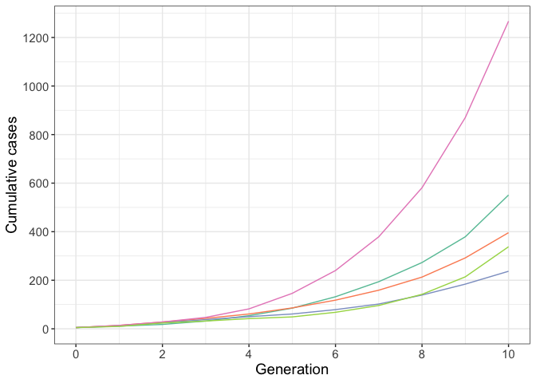

# *pepbp*: Modelling the effect of post-exposure prophylaxis for high-risk contacts on outbreak transmission and control

***pepbp*** is a package to simulate a branching process model
describing an infectious disease outbreak where high-risk contacts of
cases receive post-exposure prophylaxis, which reduces their probability
of becoming a case.

See
[Methods](https://github.com/sophiemeakin/pepbp?tab=readme-ov-file#methods)
for a full description of the branching process model. An installation
and quick-start guide for the package is below.

## Installation

You can install the package from Github:

``` r
devtools::install_github("sophiemeakin/pepbp")
```

## Quick start guide

The main functionality of the package is `scenario_sim()`. Here is an
example to run five iterations for a given scenario:

``` r
res <- scenario_sim(
  n_sim = 5,            # number of iterations
  prop_pep = 0.8,       # probability that high-risk contacts (HRCs) receive PEP
  rel_risk = 0.5,       # relative risk of becoming a case after receiving PEP
  hrc_mu = 2,           # average number of HRCs per case
  hrc_disp = 1,         # overdispersion of number of HRCs
  lrc_mu = 5,           # average number of low-risk contacts (LRCs) per case
  lrc_disp = 10,        # overdispersion of number of LRCs
  p_hrc_case = 0.75,    # probability that HRCs become a case (without PEP)
  p_lrc_case = 0.1,     # probability that LRCs become a case
  n_initialcases = 5,   # number of initial cases
  cap_max_gen = 10,     # BP stopping criteria, generations
  cap_max_cases = Inf   # BP stopping criteria, total cases
)
```

We can then, for example, plot the total cases by generation:

``` r
res %>%
  count(iter, generation) %>%
  complete(iter, generation, fill = list(n = 0)) %>%
  group_by(iter) %>%
  mutate(n_cuml = cumsum(n)) %>%
  ggplot(aes(x = generation, y = n_cuml, col = as.factor(iter))) +
  geom_line(show.legend = FALSE) +
  scale_x_continuous(limits = c(0, NA), breaks = seq(0, 10, 2)) +
  scale_y_continuous(limits = c(0, NA), breaks = seq(0, 5000, 200)) +
  scale_color_brewer(palette = "Set2") +
  labs(x = "Generation", y = "Cumulative cases") +
  theme_bw() +
  theme(text = element_text(size = 14))
```



See `vignettes/example-application.Rmd` for an application of this model
to explore the effect of post-exposure prophylaxis for high-risk
contacts on transmission and control of an infectious disease outbreak.

## Methods

### Input

The branching process model has five inputs:

-   The initial number of cases, `n`.
-   The distribution of the number of high- and low-risk contacts per
    case.
-   The probability that high- and low-risk contacts become cases,
    `q_HR` and `q_LR`, respectively.
-   The probability that each high-risk contact receives PEP, `p`.
-   The effectiveness of PEP, defined as the relative risk that a
    high-risk contact becomes a case after receiving PEP, `theta`.

### Model

The outbreak is initialised with `n` cases. Then, for each case:

1.  *Generate contacts:* Sample the number of high- and low-risk
    contacts from the respective negative binomial distributions.
2.  *Assign PEP to high-risk contacts:* Each high-risk contact receives
    PEP with probability `p`.
3.  *Determine secondary cases:*
    -   High-risk contacts who did not receive PEP become cases with
        probability `q_HR`.
    -   High-risk contacts who did receive PEP become cases with
        probability `theta*q_HR`.
    -   Low-risk contacts become cases with probability `q_LR`.
4.  Repeat 1 - 3 for new generation of cases.

### Output

In the output each row represents a case, for which we report the
following:

-   The number of high- and low-risk contacts
-   The number of high-risk contacts who do and do not receive PEP
-   The number secondary cases (high-risk contacts who received PEP;
    high-risk contacts who did not receive PEP; low-risk contacts)

------------------------------------------------------------------------

## Acknowledgements

The structure of {pepbp} is based on the
[{ringbp}](https://epiforecasts.io/ringbp/index.html) package,
originally developed by Joel Hellewell, Sam Abbott, Amy Gimma, Tim Lucas
and Sebastian Funk. Thank you!
